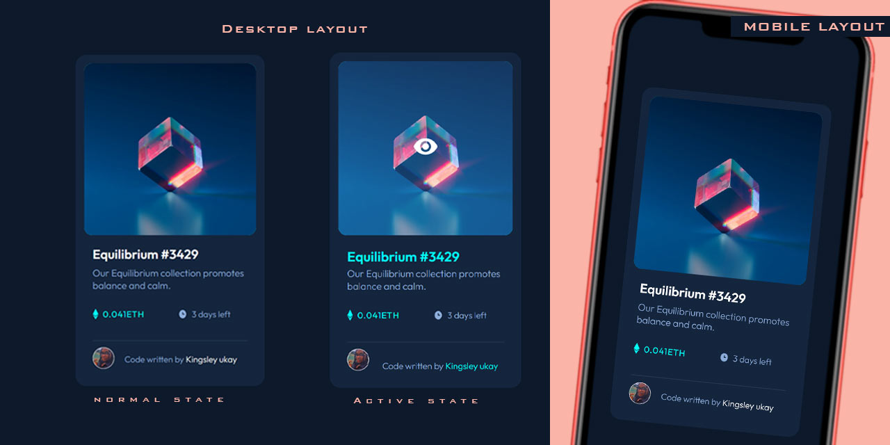

# Frontend Mentor - NFT preview card component solution

This is a solution to the [NFT preview card component challenge on Frontend Mentor](https://www.frontendmentor.io/challenges/nft-preview-card-component-SbdUL_w0U). Frontend Mentor challenges help you improve your coding skills by building realistic projects.

## Table of contents

- [Overview](#overview)
- [The challenge](#the-challenge)
- [Screenshot](#screenshot)
- [Built with](#built-with)
- [Useful resources](#useful-resources)
- [Author](#author)
- [Acknowledgments](#acknowledgments)

## Overview

### The challenge

Users should be able to:

- View the optimal layout depending on their device's screen size
- See hover states for interactive elements

### Screenshot

### Links

- Solution URL: [My GitHub Page](https://github.com/DevUKay/NFT-Card-Widget-challenge.git)
- Live Site URL: [My Live Design](https://devukay.github.io/NFT-Card-Widget-challenge/)

## My process

### Built with

- Semantic HTML5 markup
- CSS custom properties
- Flexbox
- Mobile-first workflow

## Author

- Frontend Mentor - [@DevUKay](https://www.frontendmentor.io/profile/DevUKay)
- Twitter - [@kingkayyy](https://twitter.com/kingkayyy)

## Acknowledgments

My grateful to me for not giving up, lol the battle for the repo to online was real hahhaha, but yea,i finally did it. so enjoy.
